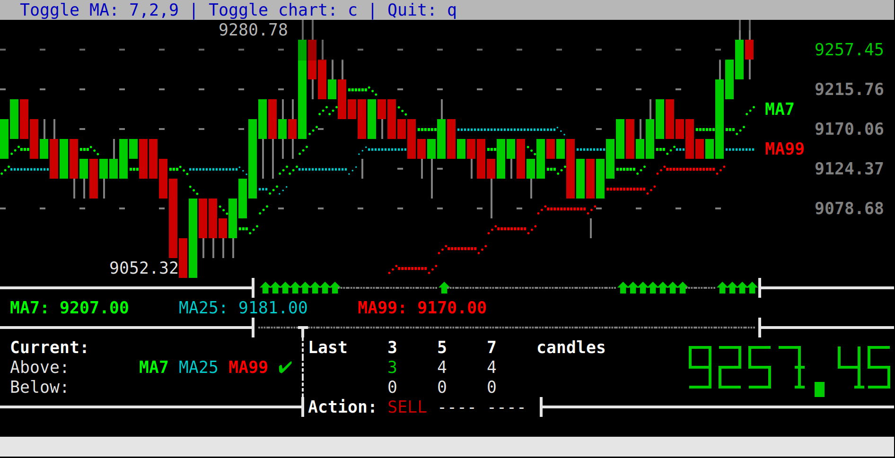
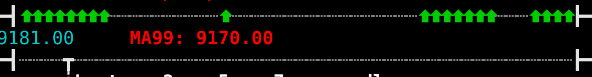
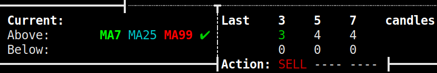

# How it works

The bot uses Binance API for getting prices, and calculating the 7,25,99 moving averages. It follows a very simple strategy:

- when price is below the MAs -> buy
- when above -> sell

It can handle (in theory) infinite number of simultaneous trades, each one is individually configurable. You can set how quickly it reacts to up/down price changes, what is the minimum profit to earn, and how much do you want to allocate for trades. Inverted trading is planned in the future (BTC-USDT - USDT-BTC)

By deafult it uses 15min candles with BTCUSDT pair globally, but it's also configurable.

### Display

The bot displays all important information in one screen. The largest part is the current price, and the MAs. ([Larger image](images/terminalbot2.png))

Below that is a line with green and (currently not shown) red arrows that shows the points where the price was above/below the moving averages:

There is an indicator for the current price, to see it's position relative to all MAs, and at the right side it shows how long this condition has been lasted.

In this case the current price is above all of the MAs.

The bot is configured to have 3 "threads", with a "reaction time" of 3, 5, 7 candles.
The first one shows it's a perfect time to sell what we have, because in the last 45 mins (3x15) the price was above the averages. If it lasts to 75 mins (5x15), the second indicator will show a SELL signal too.

And the same goes when the price drops below the MAs (with BUY signals).

### Is it usable?

Currently it's in development stage, and it's only capable of indicating buy/sell, but it doesn't send real orders to exchange. (Signed order sending is tested, but not yet implemented)
