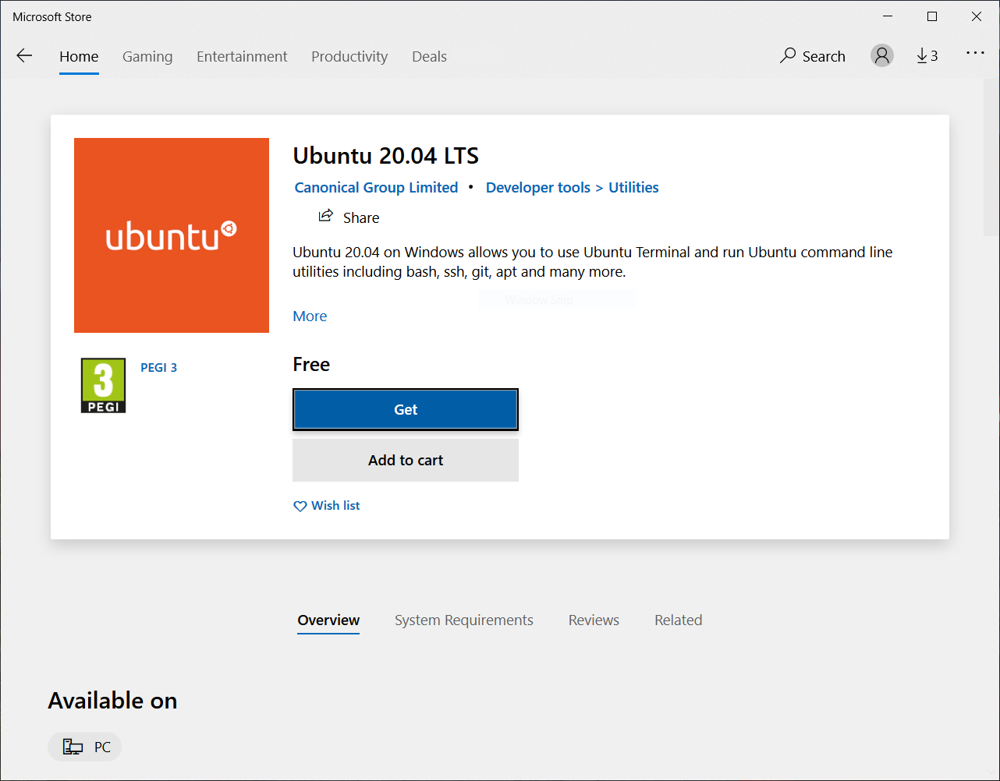

# How to install

Below instructions were made for Ubuntu linux 18.04, but you can adopt it to any other *nix system easily.

Tested on:
- Ubuntu 18.04 x64
- Raspberry Pi 3B+, Raspbian 32bit
- Windows 10, Windows subsystem for Linux with Ubuntu 20.04

## Installing on Windows 10

You will need to enable the inbuilt linux subsystem feature in Control Panel/Programs and features:


After reboot go to MS Store, and install Ubuntu:


Select a linux user name, and a password:

This username is your username inside the linux install. The given password is usually referred to as **root** or **sudo** password.

Now you have a working linux command line. Copy/paste the below commands to the window:
```
sudo apt-get update
sudo apt-get install libssl-dev libcurl4-openssl-dev libjsoncpp-dev git cmake build-essential
```

Now you can continue with the steps in the linux install section.

## Installing on Windows 7 and below


## Installing on linux

### Install  curl, jsoncpp, openssl, git:
```
sudo apt-get update
sudo apt-get install libssl-dev libcurl4-openssl-dev libjsoncpp-dev git
```

### Install  newest  cmake:
Currently it's 3.17
```
sudo apt-get purge cmake
mkdir ~/temp
cd ~/temp
wget https://github.com/Kitware/CMake/releases/download/v3.17.0/cmake-3.17.0.tar.gz
tar -xzvf cmake-3.17.0.tar.gz
cd cmake-3.17.0/
./bootstrap
make
sudo make install
```
Check your version: `cmake --version`

### Clone terminalbot to your computer

```
git clone https://github.com/Deybacsi/terminalbot.git
cd terminalbot
git submodule init
git submodule update
```


Now you should [configure](/terminalbot/configure) your bot, and compile.
